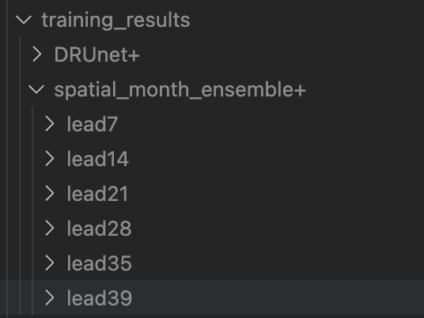

# S2S_weather: Improving Subseasonal-to-Seasonal Weather Forecasting by Leveraging Statistical Post-Processing
End of studies interniship at INRIA Paris in ARCHES team, supervised by Claire Monteleoni and David Landry (May-November 2024)

Subseasonal-to-Seasonal (S2S) weather forecasts are global or local weather predictions (classically 2meter temperature and total precipitation) beyond 2 weeks but less than 3 months ahead. These types of forecasts are essential for climate change adaptation, with an increasing number of extreme meteorological events (floods, cold-waves) threatening infrastructures and human health. However, classical Numerical Weather Predictions (NWP) atmospheric models show low skill at these ranges, as they are too far from the initial conditions while being sensitive to slowly evolving coupled components with the ocean.

We investigated statistical post-processing methods, including deep learning, to improve the IFS forecasts from the European Centre for Medium-Range Weather Forecasts, for 2m temperature and 10m wind speed, at 7, 14, 21, 28, 35 and 39 days ahead. We built reusable pipelines for [WeatherBench2](https://github.com/google-research/weatherbench2) (Rasp et al. 2024) data, from downloading to pre-processing. We also discussed and implemented normalization strategies and metrics fit to our problem and weather post-processing in general. You can read our findings in the [report](https://github.com/mayajanvier/S2S_weather/blob/main/Report_S2S_MayaJanvier.pdf). 

Figure: CRPSS of 2m temperature at lead 14 days for different methods: top row: raw model and EMOS (Gneiting et al. 2005), bottom row: variants of DRUNet (Pic et al. 2024)

# Repository organisation 
## Preparing the data
The `parameter` folder contains the WeatherBench2 paths to the files we used in this study.

The `processings` folder contains codes to download (`download_weatherbench2.py`), format (`format_data.py`) and pre-process this data (`dataset.py`). Follow the instructions in the README file in the folder before running any experiments. For DRUnet, the [Month Lead Agg] is performed by the WeatherYearEnsembleDataset, while the [General Agg] by the WeatherYearEnsembleDataset. 

## Training models
You can train the different architectures of this project by running the functions in `main.py`. The corresponding models are defined in `model.py`: 
- post-processing models: SpatialEMOS (EMOS), DRUNetPrior (DRUnet+prior both), DRUnetPriorVar (DRUnet+prior single)
- forecasting models: DRUnet (DRUnet both), DRUnetVar (DRUnet single)

_Work in progress: DRUnetAll to unify all these variants under a single structure._

Define your `training_results` folder, and create subfolders for `EMOS` and `DRunet`. For EMOS, also create sub-folders for each lead (`lead7`, `lead14`, etc). It should look like this: 

Update the paths accordingly in the main loop (`base_dir` variable), as well as the `data_folder`, `train_folder`, `obs_folder` in the `mainXXX` routines. 

### EMOS

In order to train EMOS, comment the DRUnet part in the main loop and adjust the hyper-parameters (lr, batch_size, nb_epoch) in `main_spatial_ens`. To launch the training, use `sbatch train.sbatch`, modifying the lead using `-lead` within the bash script.

### DRUnets

In order to train a DRUnet, comment the EMOS part in the main loop, uncomment your variant `main_Unet_ensXXX` part and adjust the hyper-parameters (lr, batch_size, nb_epoch) in it. To launch the training, use `sbatch train_drunet.sbatch`, modifying (DRUnets single) or removing (DRUNets both) the variable using `-var` within the bash script.

## Evaluating models
Samely, you can run the inference for these models using `inference.py`, as well as compute the baseline results, that is to say the Raw model (IFS) we are trying to post-process. The results will be save in a `crps.nc` file within the model folder in `training_results`.

In order to evaluate EMOS, comment the DRUnet part in the main loop and uncomment the `specialSpatialEMOS_inference_detrend` line. Launch using `sbatch inference.sbatch`. 

In order to evaluate RAW, comment the DRUnet part in the main loop and the uncomment `RawIFS_inference` line. Launch using `sbatch inference.sbatch`. 

In order to evaluate a DRUnet, comment the EMOS and RAW part and uncomment the DRunet part along with the `DRUnet_inferenceXXX` you are interested in. Launch using `sbatch inference_drunet.sbatch`, modifying the -var (variable), -id (number id in training result folder) and -e (epoch checkpoint to evaluate) in it.

You will then be able to visualize the results with the `figures_results.ipynb` notebook. The `figures_data.ipynb` notebook provides some code to visualize our data. 

